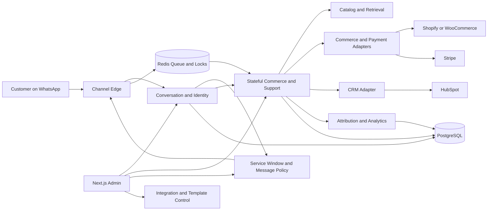
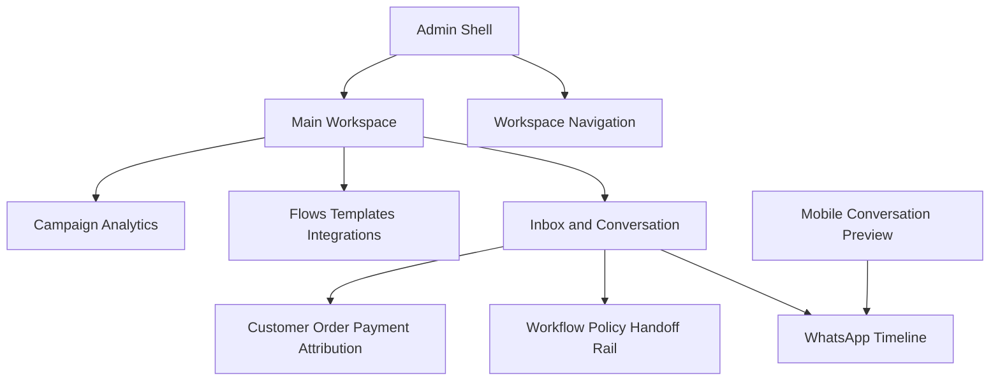

# WhatsApp Commerce and Support Agent

## Header

| Field | Value |
|---|---|
| Product | WhatsApp Commerce and Support Agent |
| Pitch | Handles product questions, commerce, appointments, order status, and human support over WhatsApp for international businesses. |
| Status | Greenfield |
| Author | OpenCode |
| Date | 2026-08-04 |
| Delivery window | 3 to 5 weeks `[verified]` |
| UI | Required |
| Existing codebase | None; target directory was empty before this PRD |
| Verified product source | `D:\ARC Automation Service\Project list.md`, section 5 |

### Source discipline

- `[verified]` means supplied project input or section 5 of `Project list.md`.
- `[inferred]` means a proposed product or implementation decision required to make the MVP buildable.
- `[uncertain]` means provider behavior, approval, capability, version, quota, benchmark, or policy detail not supplied by the source.
- No team size, budget, external deadline, price, certification, provider version, quota, or production benchmark is assumed.

## Project Summary

The product is a WhatsApp-first commerce and support agent for international-facing ecommerce brands, clinics, travel companies, education businesses, real-estate companies, dealerships, and service businesses. `[verified]` It answers product questions, recommends products, supports catalog and payment-link flows, handles appointments and order status, qualifies leads, synchronizes CRM records, sends reminders through approved templates, and hands conversations to people. `[verified]`

The MVP uses a Next.js admin with a FastAPI or Node.js backend, PostgreSQL, Redis, and webhook processing, with Meta WhatsApp Cloud API, Twilio WhatsApp, Shopify, WooCommerce, HubSpot, and Stripe as the integration boundary. `[verified]` The build must make the 24-hour service window, approved templates, opt-outs, stateful workflows, retries, human takeover, and attribution visible and enforceable. `[verified]`

## Table of Contents

- [Header](#header)
- [Project Summary](#project-summary)
- [Table of Contents](#table-of-contents)
- [Product Overview](#product-overview)
- [Technology Stack](#technology-stack)
- [System Architecture](#system-architecture)
- [Core Design: Stateful WhatsApp Commerce](#core-design-stateful-whatsapp-commerce)
- [Design System](#design-system)
- [Build Plan](#build-plan)
- [Open Decisions & Future Scope](#open-decisions--future-scope)
- [Appendix: References](#appendix-references)

## Product Overview

### Product job

Turn an inbound WhatsApp conversation into a controlled business outcome without losing channel context. Valid outcomes are an answer, product recommendation, appointment request or booking, order update, payment link, qualified lead, or human-owned support conversation.

### Product promise

| Outcome | MVP behavior |
|---|---|
| Product questions | Retrieve approved product facts, answer in the selected conversation language, and avoid guessed availability or price. |
| Commerce | Show product choices, capture selection and quantity, require confirmation, create a checkout or payment link, and reconcile status. |
| Appointments | Collect configured fields, require confirmation, submit a configured request, or create a human task when no booking action exists. |
| Order status | Resolve a safe lookup key, query Shopify or WooCommerce, and return source-backed status with timestamp. |
| Lead qualification | Collect configured fields and synchronize the final operator-correctable record to HubSpot when enabled. |
| Human support | Stop automation, preserve context, notify an operator, and keep the conversation human-owned until explicit resume. |
| Campaign analytics | Attribute messages and outcomes to source, campaign, template, workflow, and conversion events. |

### Goals

- Deliver product-question, catalog, commerce, appointment, order-status, lead-qualification, CRM-sync, reminder, and human-handoff paths.
- Support Meta WhatsApp Cloud API and Twilio WhatsApp behind one normalized channel boundary.
- Support Shopify, WooCommerce, HubSpot, and Stripe behind typed, independently testable adapters.
- Provide the portfolio assets named by the source: mobile conversation, flow builder, agent inbox, customer profile, template manager, and campaign analytics.
- Keep state, tool calls, side effects, policy decisions, retries, and attribution inspectable by an operator.

### Roles and permissions

| Role | Read | Send | Take over | Configure | Analytics |
|---|---:|---:|---:|---:|---:|
| Admin | All workspace conversations | Yes, subject to policy | Yes | Flows, integrations, templates | Full |
| Operator | Shared or assigned inbox | Yes, subject to policy | Yes | No | Operational |
| Viewer | Yes | No | No | No | Read-only |

Workspace-scoped authorization is `[inferred]`; every conversation, customer, message, workflow run, integration event, and analytics event carries `workspace_id`.

### Functional requirements

| ID | Requirement | Acceptance behavior |
|---|---|---|
| FR-01 | Receive and verify inbound webhook events | Normalize one valid event, quarantine invalid input, and deduplicate replays. |
| FR-02 | Resolve customer and conversation | One workspace/channel identity maps to one customer; inbound acceptance opens or refreshes the service window. |
| FR-03 | Answer product questions | Use configured catalog/content, preserve language, expose source/tool results, and hand off when data is missing. |
| FR-04 | Recommend products | Return product IDs, display names, availability state, and a reason tied to captured constraints. |
| FR-05 | Support commerce | Store selection and quantity, require confirmation, create a link, and never treat link creation as payment success. |
| FR-06 | Handle appointments | Collect required fields, summarize, confirm, submit if configured, and otherwise create a human task. |
| FR-07 | Handle order status | Request a safe identifier, query Shopify/WooCommerce, and handle no-match or multiple-match without disclosure. |
| FR-08 | Qualify and sync leads | Show collected and missing fields, allow operator correction, and make HubSpot sync idempotent. |
| FR-09 | Handle human requests | Detect explicit requests and configured failure triggers; pause autonomous sends and preserve ownership history. |
| FR-10 | Report campaign outcomes | Record sends, delivery/read states when available, replies, workflow completion, payment, handoff, opt-out, and conversion linkage. |

### Concrete failure modes

- A duplicate webhook must not create a duplicate message, workflow transition, CRM record, payment link, or analytics event.
- A closed service window must not send free-form text; an unavailable approved template must produce an operator task instead.
- A provider timeout must retry with the same idempotency key; a permanent error must dead-letter without silently rewriting the command.
- A missing catalog, order, payment, or appointment result must produce a clarification or human handoff, never a guessed answer.
- A takeover or opt-out must prevent queued automation from reaching the provider, even if the queue item was previously allowed.

### Non-goals and scope boundary

| Not in MVP | Why it is excluded |
|---|---|
| Full multi-channel helpdesk | This product is scoped to WhatsApp support and operator takeover. |
| Autonomous refunds, cancellations, inventory changes, or other irreversible mutations | Read operations and payment-link creation are enough for the demo; irreversible actions require an operator. |
| General-purpose chatbot builder | Flows are limited to typed nodes for the named outcomes. |
| Voice calling implementation | The source names voice transition, but no voice infrastructure is specified; represent a transition or handoff event only. `[uncertain]` |
| Platform billing or customer-facing web checkout | Stripe serves the configured customer payment-link path; platform billing is separate scope. |
| Large-scale campaign automation | MVP provides controlled template sends and attribution, not a marketing automation suite. |
| Legal, compliance, residency, or certification claims | Jurisdictional requirements are `[uncertain]` and must be verified before production. |

### Success metrics

Targets are MVP operating targets `[inferred]`, not provider benchmarks.

| Metric | Type | Definition | Initial target |
|---|---|---|---:|
| Inbound deduplication correctness | Numeric | Replayed valid events that create no duplicate side effect | 100% of replay tests |
| Outbound policy-block correctness | Numeric | Blocked commands that never reach a provider | 100% of policy tests |
| Workflow completion rate | Numeric | Runs reaching a business outcome without human takeover | At least 70% of seeded traces |
| Handoff claim time | Numeric | Median time from task creation to operator claim | At most 5 minutes in staffed demo |
| Attribution completeness | Numeric | Conversion events linked to a named source or explicit `unknown` | At least 95% |
| Retry recovery rate | Numeric | Transient failures recovered before dead-letter | At least 90% of retry tests |
| Operator brief clarity | Qualitative observable behavior | Operator selects `clear`, `partly clear`, or `not clear` after a demo handoff | At least 4 of 5 are `clear` |

## Technology Stack

| Layer | Selection or boundary | Requirement-specific justification |
|---|---|---|
| Admin UI | Next.js | Explicitly listed in section 5 and needed for the inbox, flow builder, customer profile, template manager, and analytics UI. `[verified]` |
| API and workflow service | FastAPI selected from FastAPI or Node.js | `[inferred]` selection for explicit webhook, typed adapter, and workflow contracts; Node.js remains a valid equivalent. |
| Durable state | PostgreSQL | Explicitly listed and suited to conversations, workflow versions, service windows, audit history, integrations, and attribution. `[verified]` |
| Work dispatch and locks | Redis | Explicitly listed and used for webhook-to-worker dispatch, bounded retries, and conversation locks. `[verified]` |
| Channel edge | Webhook processing | Explicitly listed; acknowledges provider events quickly and moves work to a queue. `[verified]` plus `[inferred]` flow. |
| Conversation engine | LLM engine, retrieval, recommendation logic, multilingual support, tool calling | These capabilities are named by section 5; model vendor, version, limits, and cost are `[uncertain]`. |
| Channel adapters | Meta WhatsApp Cloud API and Twilio WhatsApp | Both are listed APIs; provider payload and approval behavior are `[uncertain]` until credentials are tested. |
| Commerce adapters | Shopify and WooCommerce | Both are listed APIs and cover product, availability, checkout/order, and status paths. `[verified]` |
| CRM adapter | HubSpot | Listed for CRM synchronization and lead/contact field updates. `[verified]` |
| Payment adapter | Stripe | Listed for payment-link and payment-status path; exact account configuration is `[uncertain]`. |

### Required adapter operations

| Adapter | Operations required in MVP | Normalized result |
|---|---|---|
| Meta / Twilio | Verify inbound, send text/template/media/interactive when supported, receive status | Provider message ID, status, timestamp, error code/message |
| Shopify / WooCommerce | Catalog lookup, availability lookup, checkout/order lookup, event intake when available | Product, availability, checkout/order, external event ID |
| HubSpot | Find/create contact or lead, update qualification fields | External ID, status, field errors |
| Stripe | Create payment link or configured payment object, verify payment event | External ID, URL, status, amount/currency when returned |

Provider API versions, exact webhook verification schemes, object names, quotas, interactive payload support, and approval timing are `[uncertain]`; the adapter must expose unsupported capability instead of fabricating it.

## System Architecture

### Bounded contexts



All modules and boundaries in this section are `[inferred]` implementation proposals based on the verified stack boundary.

### Request-to-response communication flow

1. The customer sends a WhatsApp message through the configured Meta or Twilio channel.
2. The channel webhook verifies the request and builds the normalized inbound envelope.
3. The webhook persists the envelope and idempotency key before acknowledging the provider.
4. Redis dispatches the event to the workflow worker; the worker acquires a conversation-scoped lock.
5. The worker loads customer, conversation, current workflow version, service window, opt-out, takeover, and attribution state from PostgreSQL.
6. The workflow calls retrieval or a typed adapter only when the current state authorizes that action.
7. The policy gate evaluates the outbound command immediately before enqueue and again immediately before provider submission.
8. The provider receives either allowed free-form text, an approved template, or no message; blocked commands become operator tasks.
9. Provider delivery/status events return through the same webhook boundary and update message, workflow, and analytics records idempotently.
10. The admin reads the resulting transcript, state, policy decision, tool result, retry history, and attribution trail.

### Proposed directory tree

The target is greenfield; this tree is `[inferred]` and is not a report of existing files. Every proposed file has an inline purpose comment.

```text
WhatsApp_Commerce_and_Support_Agent/                 # [inferred] project root
  admin/                                             # [inferred] Next.js admin application
    app/layout.tsx                                   # [inferred] workspace shell and navigation
    app/inbox/page.tsx                               # [inferred] shared operator inbox
    app/inbox/[conversationId]/page.tsx              # [inferred] transcript and policy detail
    app/customers/[customerId]/page.tsx              # [inferred] customer identity and history
    app/flows/page.tsx                               # [inferred] bounded flow builder
    app/templates/page.tsx                           # [inferred] approval-state template manager
    app/integrations/page.tsx                        # [inferred] adapter health and setup
    app/analytics/page.tsx                           # [inferred] campaign and outcome reporting
    app/events/page.tsx                              # [inferred] webhook and dead-letter console
    components/ConversationTimeline.tsx              # [inferred] message rendering and delivery state
    components/PolicyGate.tsx                         # [inferred] visible send decision and block reason
    components/WorkflowRail.tsx                       # [inferred] current state and transition history
    package.json                                      # [inferred] admin dependencies and scripts
    api/app/main.py                                   # [inferred] FastAPI entry point
    api/app/webhooks/routes.py                        # [inferred] provider webhook endpoints
    api/app/workflows/service.py                      # [inferred] state transitions and tool dispatch
    api/app/policy/service.py                         # [inferred] window, template, opt-out, and takeover gate
    api/app/adapters/base.py                          # [inferred] normalized adapter interfaces
    api/app/adapters/whatsapp.py                      # [inferred] Meta and Twilio channel adapters
    api/app/adapters/commerce.py                      # [inferred] Shopify and WooCommerce adapter contract
    api/app/adapters/hubspot.py                       # [inferred] CRM synchronization adapter
    api/app/adapters/stripe.py                        # [inferred] payment-link and event adapter
    api/app/schemas/contracts.py                      # [inferred] typed inbound, outbound, and state schemas
    api/app/persistence/models.py                     # [inferred] PostgreSQL model definitions
    api/app/workers/queue.py                          # [inferred] Redis dispatch and bounded retries
    api/app/analytics/service.py                      # [inferred] attribution and funnel event writer
    tests/test_policy.py                              # [inferred] service-window and opt-out tests
    tests/test_idempotency.py                         # [inferred] replay and side-effect tests
    tests/test_traces.py                              # [inferred] end-to-end demo traces
```

### Persistence and concurrency boundary

| Record | Required fields or constraint |
|---|---|
| `customers` | Unique `workspace_id + channel + channel_identity`; language and opt-out timestamp. |
| `conversations` | Customer, owner, takeover flag, current service window, latest message, current version. |
| `messages` | Direction, kind, normalized body, template key, provider ID, delivery state, error. |
| `workflow_runs` and `workflow_transitions` | Versioned current state plus append-only actor, reason, event, timestamp, and tool call history. |
| `templates` | Local/provider status, locale, variables, allowed workflows, approval timestamp. |
| `integration_events` | External ID, idempotency key, payload reference, attempts, status, error. |
| `handoff_tasks` | Reason, priority, owner, summary, open/claimed/resolved state. |
| `attributions` and `analytics_events` | Source, campaign, template, workflow, first/last touch, conversion and outcome events. |

Provider secrets are stored as secret references and raw payloads are restricted `[inferred]`. Acquire a conversation lock before a workflow transition, operator takeover, or outbound submission. A stale operator action is rejected by version check; takeover wins over queued automation before provider submission.

## Core Design: Stateful WhatsApp Commerce

### State and transition contract

```ts
type WorkflowKind = "product_question" | "commerce" | "appointment" | "order_status" | "lead_qualification" | "human_support";
type WorkflowState = "new" | "identifying_intent" | "collecting_fields" | "retrieving" | "awaiting_confirmation" | "executing_tool" | "awaiting_external_event" | "human_requested" | "human_takeover" | "automation_resumed" | "completed" | "cancelled" | "opted_out" | "failed_recoverable";
type Channel = "meta_cloud" | "twilio_whatsapp";
type ISODateTime = string;
type UUID = string;

interface ServiceWindow { opened_at: ISODateTime | null; expires_at: ISODateTime | null; source_message_id: UUID | null; status: "active" | "expired" | "unknown"; }
interface WorkflowRun { id: UUID; conversation_id: UUID; kind: WorkflowKind; state: WorkflowState; version: number; slots: Record<string, string | number | boolean | null>; pending_action: string | null; last_error_code: string | null; }
interface TemplatePolicy { key: string; channel: Channel; locale: string; local_status: "draft" | "submitted" | "approved" | "rejected" | "disabled"; provider_status: "unknown" | "pending" | "approved" | "rejected"; required_variables: string[]; allowed_workflows: WorkflowKind[]; }
interface InboundEvent { event_id: string; workspace_id: UUID; adapter: Channel; channel_identity: string; provider_message_id: string; kind: "text" | "template" | "interactive" | "media"; body_text: string | null; occurred_at: ISODateTime; raw_payload_reference: string; }
interface OutboundCommand { command_id: UUID; conversation_id: UUID; channel: Channel; mode: "free_form" | "approved_template"; text: string | null; template_key: string | null; variables: Record<string, string>; idempotency_key: string; policy_snapshot: { service_window: "active" | "expired" | "unknown"; opted_out: boolean; human_takeover: boolean; }; }
interface HandoffTask { id: UUID; conversation_id: UUID; reason: "customer_requested" | "tool_failure" | "unsupported_intent" | "low_confidence" | "operator_action"; priority: "normal" | "urgent"; summary: string; assigned_user_id: UUID | null; status: "open" | "claimed" | "resolved" | "cancelled"; }
interface Attribution { id: UUID; conversation_id: UUID; source: string | "unknown"; campaign_id: string | null; template_key: string | null; workflow_run_id: UUID | null; first_touch_at: ISODateTime; last_touch_at: ISODateTime; conversion_event_id: UUID | null; }
```

### Workflow rules

- A workflow run has one current state and append-only transition history; every transition carries event ID, actor, reason, timestamp, and optional tool call ID.
- Tool calls are side effects. Commit the pending action before dispatch and mark it complete only after the normalized adapter result is persisted.
- Ask for missing fields, persist corrections, and never execute a tool from natural-language intent alone.
- Terminal outcomes are `completed`, `handed_off`, `cancelled`, `opted_out`, and `failed_recoverable`.
- Unsupported capability, missing source data, repeated tool failure, low confidence, or explicit human request moves to `human_requested`.

### Supported state paths

| Workflow | State path and behavior |
|---|---|
| Product question | `new -> retrieving -> awaiting_confirmation`; missing constraints use `collecting_fields`; source gaps or unsupported intent hand off. |
| Commerce | `new -> awaiting_confirmation -> executing_tool -> awaiting_external_event -> completed`; link creation is separate from verified payment/order confirmation. |
| Appointment | `new -> collecting_fields -> awaiting_confirmation -> executing_tool -> awaiting_external_event -> completed`; no configured booking action creates a task. |
| Order status | `new -> collecting_fields -> retrieving -> completed`; no-match asks once for correction, repeated or multiple matches hand off. |
| Lead qualification | `new -> collecting_fields -> awaiting_confirmation -> executing_tool -> completed`; HubSpot sync is operator-correctable and idempotent. |
| Human support | `human_requested -> human_takeover`; automation remains paused until explicit `automation_resumed`, resolution, or cancellation. |

### 24-hour service-window behavior

The application owns a conservative service-window record `[inferred]`; provider enforcement is authoritative and provider-specific policy is `[uncertain]`.

| Event or condition | Required behavior |
|---|---|
| Accepted inbound customer message | Set `opened_at` to the accepted event time and `expires_at` to `opened_at + 24 hours`. |
| Before expiry | Permit configured free-form response only when not opted out, not human-owned, and provider send capability is available. |
| At or after expiry | Block free-form text. Select only an eligible approved template whose workflow authorizes the send. |
| No eligible approved template | Do not send; create an operator task with the block reason. |
| New inbound after expiry | Reopen the window and process the inbound message normally. |
| Queued command | Re-evaluate expiry immediately before provider submission; never use a stale active decision. |
| Human takeover | Block automation regardless of window state until explicit resume. |

### Approved templates

| Template key | Purpose | Required variables | Allowed workflow |
|---|---|---|---|
| `order_status_update` | Customer-requested order update | `customer_name`, `order_reference`, `status_label`, `status_link` | Order status |
| `appointment_reminder` | Reminder for a confirmed appointment | `customer_name`, `appointment_time`, `location_or_link` | Appointment |
| `payment_link_follow_up` | Follow-up for an explicitly requested link | `customer_name`, `amount_label`, `payment_link` | Commerce |
| `human_handoff_ack` | Acknowledge queued human support | `customer_name`, `business_hours_or_next_step` | Human support |
| `service_window_reopen` | Invite a reply to continue | `customer_name`, `next_step` | Configured re-engagement |

A send outside the service window requires local status `approved`, provider status `approved`, enabled locale, valid variables, authorized workflow, and no opt-out. The keys and variables are application contracts; provider category, final body copy, locale support, and approval result are `[uncertain]`.

### Opt-out contract

| Input | Required behavior |
|---|---|
| Configured opt-out phrase or action | Set `opted_out_at`, emit `opt_out`, and stop campaign, reminder, and proactive template sends. |
| Opt-out during human takeover | Block both automation and operator-UI outbound sends. |
| New inbound after opt-out | Process support inbound without clearing opt-out implicitly. |
| Explicit request to receive messages again | Emit `consent_review_required`; an operator must confirm the configured re-consent path. |

Phrase sets, consent evidence, regional rules, and provider-specific opt-out behavior are `[uncertain]`; the MVP stores configurable phrases and an immutable event trail.

### Retry and dead-letter contract

| Failure | Required behavior |
|---|---|
| Duplicate event | Acknowledge idempotently; no retry. |
| Invalid schema | Quarantine and alert; no automatic retry. |
| Timeout or transient provider failure | Retry at 5 seconds, 30 seconds, and 5 minutes `[inferred]`, then dead-letter. |
| Rate limit | Use provider retry hint when present `[uncertain]`; otherwise use bounded backoff. |
| Auth/permission failure | Stop retries, mark integration unhealthy, and create operator task. |
| Template rejection, closed window, or opt-out | Do not retry unchanged; require a new policy decision. |
| Dead letter | Show payload reference, attempt count, error, and replay action; replay rechecks all policy gates. |

Every retry rechecks idempotency, service-window state, template approval, opt-out, takeover, and integration health.

### Human takeover and attribution

Human takeover is triggered by explicit request, unsupported intent, repeated tool failure, low-confidence state, or operator action. The handoff brief contains customer identity, language, summary, workflow state, missing fields, tool errors, order/payment identifiers, and attribution. Claim, assignment, reply, resolve, and resume actions are audited.

Attribution is attached to messages and workflow runs. Explicit campaign/template metadata is first touch; the latest campaign before conversion is last touch; direct traffic is `source=unknown`; conversion links to the workflow that created the payment link, confirmed appointment, completed order outcome, or configured lead outcome. Handoff and opt-out are outcome events, not positive conversions unless an operator explicitly records a conversion.

### Adapter and idempotency contracts

| Operation | Idempotency key |
|---|---|
| Inbound provider event | `workspace_id + adapter + provider_event_id` |
| Outbound message | `conversation_id + client_message_id` |
| Tool call | `workflow_run_id + tool_name + action_key` |
| CRM sync | `workspace_id + customer_id + workflow_run_id + sync_kind` |
| Payment/order event | `workspace_id + adapter + external_event_id` |
| Analytics event | `source_event_id + event_type` |

No workflow imports provider SDK types directly. A provider without a stable event ID uses a deterministic normalized-payload fingerprint `[inferred]` and reports reduced deduplication confidence.

### Typed inbound and outbound examples

```ts
const inbound: InboundEvent = {
  event_id: "provider-event-id",
  workspace_id: "workspace-uuid",
  adapter: "meta_cloud",
  channel_identity: "normalized-customer-identity",
  provider_message_id: "provider-message-id",
  kind: "text",
  body_text: "Is the blue product available?",
  occurred_at: "2026-08-04T11:59:58Z",
  raw_payload_reference: "restricted-object-reference"
};

const outbound: OutboundCommand = {
  command_id: "command-uuid",
  conversation_id: "conversation-uuid",
  channel: "twilio_whatsapp",
  mode: "approved_template",
  text: null,
  template_key: "order_status_update",
  variables: { customer_name: "Customer", order_reference: "ORDER-123", status_label: "In transit", status_link: "https://configured-link" },
  idempotency_key: "conversation-uuid:client-message-id",
  policy_snapshot: { service_window: "expired", opted_out: false, human_takeover: false }
};
```

### Trace 1: product question to commerce to human support

**Input:** Customer sends `Is the blue product available?` through a configured WhatsApp adapter. The catalog has a matching available product, a checkout/payment adapter is connected, and the customer is not opted out.

1. Normalize and deduplicate the inbound event; resolve the customer and set a 24-hour window.
2. `product_question` retrieves the catalog record and returns a product card or text fallback with product ID and availability.
3. Customer selects the product and quantity; state becomes `awaiting_confirmation`.
4. Customer confirms; `commerce` creates a checkout or Stripe payment link and persists link creation separately from payment confirmation.
5. A payment/order event updates `awaiting_external_event`; the system records the conversion and attribution.
6. A delivery update is sent as free-form inside the window or as `order_status_update` outside it if approved.
7. Customer requests a human; automation pauses, a handoff task is created, and the operator sees transcript, order/payment reference, tool history, and attribution.

**Typed output:**

```ts
const result: { state: WorkflowState; message_kind: "interactive" | "text" | "template"; conversion: boolean; handoff: boolean } = {
  state: "human_takeover",
  message_kind: "template",
  conversion: true,
  handoff: true
};
```

### Trace 2: expired window to approved template retry and opt-out

**Input:** Customer has a confirmed appointment, the 24-hour window is expired, `appointment_reminder` is locally and provider approved, and the first provider attempt times out.

1. The reminder worker refuses free-form text because `expires_at` has passed.
2. The policy gate validates template status, locale, variables, workflow authorization, and opt-out state.
3. The command is queued with an idempotency key; the provider timeout schedules retries at 5 seconds, 30 seconds, and 5 minutes `[inferred]`.
4. Every retry rechecks window, opt-out, takeover, approval, and idempotency.
5. If the customer sends `stop` before retry, the system records `opt_out`, cancels the queued command, and sends nothing.
6. If the provider rejects the approved template, the command is dead-lettered with no free-form fallback; an operator can inspect and replay only after correction.

**Typed output:**

```ts
const blocked: OutboundCommand["policy_snapshot"] = {
  service_window: "expired",
  opted_out: true,
  human_takeover: false
};
const expected: { provider_submission: boolean; event: "opt_out"; retry_count: number } = {
  provider_submission: false,
  event: "opt_out",
  retry_count: 0
};
```

### Trace 3: order lookup no-match to operator

**Input:** Customer asks for an order update, supplies an identifier that returns no match from Shopify or WooCommerce, then asks for a human.

1. `order_status` requests a safe lookup key and queries only after the key is present.
2. No-match asks once for correction without exposing order data.
3. The second no-match or explicit human request creates `human_requested` and then `human_takeover`.
4. The handoff brief preserves both lookup attempts and adapter diagnostics; the operator replies and resolves the task.

## Design System

### Design principles

| Principle | UI consequence |
|---|---|
| Policy is visible | Every composer shows active/expired/unknown window, opt-out, takeover, and template gates before send. |
| Context beats decoration | Transcript, customer identity, workflow state, tool result, and attribution share the primary detail view. |
| Fail closed | Blocked, rejected, dead-letter, and unsupported states explain the next operator action. |
| International by default | Locale, language, timezone, currency when returned, and provider state are explicit fields. |
| Dense but calm | Dark operations surfaces, restrained color signals, clear hierarchy, and no decorative dashboard noise. |

### Color tokens

```css
:root {
  --color-bg: #0d1117; /* primary operations canvas */
  --color-surface: #151b23; /* conversation and panel surfaces */
  --color-surface-raised: #1d2631; /* focused cards and menus */
  --color-text: #f5f7fa; /* primary readable content */
  --color-text-muted: #9aa7b5; /* secondary metadata */
  --color-border: #2b3745; /* structure without heavy dividers */
  --color-signal-green: #55d187; /* healthy, active, delivered */
  --color-signal-amber: #f4b860; /* expiring, pending, needs attention */
  --color-signal-red: #f06b6b; /* blocked, failed, opted out */
  --color-signal-blue: #74b9ff; /* links, selection, navigation */
  --space-1: 4px; /* micro spacing */
  --space-2: 8px; /* control spacing */
  --space-3: 12px; /* compact content spacing */
  --space-4: 16px; /* standard panel spacing */
  --space-6: 24px; /* section spacing */
  --space-8: 32px; /* layout spacing */
  --radius-control: 8px; /* inputs and buttons */
  --radius-card: 12px; /* panels and message groups */
}
```

### Typography scale

| Token | Size/line height | Use |
|---|---|---|
| `display` | 28px / 34px | Page title and major outcome |
| `heading` | 20px / 26px | Panel and workflow heading |
| `body` | 14px / 20px | Transcript and configuration content |
| `small` | 12px / 16px | Timestamps, IDs, policy explanations |
| `label` | 11px / 14px | Status badges and compact table labels |

Use Space Grotesk for display and Inter for reading when available; fallback fonts are `[uncertain]`. Keyboard focus, semantic transcript direction, text-plus-color status, and responsive tab layout are required `[inferred]`.

### Admin layout



Desktop conversation detail uses conversation, operations, and context columns `[inferred]`; below the responsive breakpoint `[uncertain]`, they become Conversation, Operations, and Context tabs. Required views are `/inbox`, `/customers`, `/flows`, `/templates`, `/integrations`, `/analytics`, and `/events`.

### Micro-interactions

| Interaction | Behavior |
|---|---|
| `WindowBadge` | Shows active/expired/unknown and exact expiry on focus; never implies provider guarantee. |
| `PolicyGate` | Explains allowed mode, blocked reason, and next action before send. |
| `RetryInspector` | Shows attempt timeline, next retry, error class, dead-letter state, and replay action. |
| `HandoffBrief` | Supports claim, assign, resolve, and resume while exposing the state lock. |
| `TemplateStatusCard` | Separates local approval from provider approval and validates variables before test send. |
| `AttributionTrail` | Shows first touch, last touch, campaign/template, workflow, and conversion event. |
| `ProductCardPreview` | Renders returned product fields exactly; unavailable fields are labeled rather than inferred. |
| Composer transition | Changes from free-form to template-required state at expiry and disables send on opt-out or takeover. |

## Build Plan

The plan fits the source-verified 3 to 5 week delivery window. The week allocation is `[inferred]`; every phase has a demoable output.

### Phase 1: Inbound foundation and operator shell (week 1)

- [ ] Create workspace, role, customer, conversation, message, service-window, and audit contracts.
- [ ] Implement one selected WhatsApp adapter fixture and normalized inbound envelope.
- [ ] Persist provider event and idempotency key before webhook acknowledgement.
- [ ] Dispatch accepted events through Redis and render the Next.js inbox/customer profile.
- [ ] Show the service-window countdown and duplicate-event result.

**Demoable output:** A fixture message appears once in the inbox, opens a 24-hour window, and exposes customer identity and raw-event reference.

### Phase 2: Stateful outcomes and commerce (weeks 2 to 3)

- [ ] Implement product retrieval, recommendation, language field, and source/tool trace.
- [ ] Implement commerce confirmation, checkout/payment-link creation, and external status reconciliation.
- [ ] Implement order lookup for one configured Shopify or WooCommerce path, including safe no-match.
- [ ] Implement appointment and lead-qualification state contracts with HubSpot sync boundary.
- [ ] Implement human-request detection, handoff task, operator claim, pause, reply, and explicit resume.
- [ ] Add replay-safe tool-call and CRM idempotency tests.

**Demoable output:** A customer asks about product availability, selects and confirms a product, receives a link, receives a status event, and requests human support with a complete handoff brief.

### Phase 3: Policy, templates, retries, and UI assets (week 4)

- [ ] Implement service-window gate at enqueue and provider submission.
- [ ] Implement five-key template registry with local/provider approval status and variable validation.
- [ ] Implement opt-out phrases/actions, immutable event, blocked composer, and consent-review state.
- [ ] Implement bounded retry, dead-letter, provider-error classification, and safe replay.
- [ ] Implement flow builder for the typed supported nodes and the required mobile conversation preview.
- [ ] Implement template manager, customer profile, integration health, and handoff brief views.

**Demoable output:** An expired appointment reminder uses an approved template, retries a timeout, stops on opt-out, and never falls back to free-form text.

### Phase 4: Attribution, analytics, and hardening (week 5)

- [ ] Persist first-touch, last-touch, unknown-source, template, workflow, and conversion attribution.
- [ ] Report sends, deliveries when available, replies, workflow outcomes, payment events, handoffs, and opt-outs.
- [ ] Add adapter health, blocked-action explanations, concurrency tests, accessibility checks, and full trace fixtures.
- [ ] Polish the seeded presentation without adding new workflow types or provider claims.

**Demoable output:** Campaign reporting connects the product-to-checkout-to-support trace to source, template, workflow, conversion, handoff, and opt-out events.

### Three-week cut rule

If only three weeks are available, keep Phase 1, the commerce/order/handoff subset of Phase 2, and the policy/template/retry subset of Phase 3. Defer flow-builder editing, second-adapter polish, appointment reminders, and advanced analytics UI; typed contracts and blocked states remain required. `[inferred]`

## Open Decisions & Future Scope

### Open decisions

| Decision | Recommendation | Reason |
|---|---|---|
| Backend language | Select FastAPI for MVP | It is one listed option and fits explicit webhook, schema, and adapter contracts; Node.js remains interchangeable. `[inferred]` |
| Primary channel demo | Use whichever Meta or Twilio account has valid test credentials | Both are in the verified boundary; capability and approval must be observed, not assumed. `[uncertain]` |
| Interactive messages | Implement normalized interactive payload plus text fallback | WhatsApp Flow/product-card support may differ by provider/account. `[uncertain]` |
| Template approval | Keep local and provider status separate; send only when both are approved | The source requires approved templates, while final provider approval is external. `[uncertain]` |
| Appointment backend | Use a typed request and human task until a booking API is configured | No appointment provider is listed, so inventing one would expand scope. `[inferred]` |
| Model provider | Use a provider-neutral conversation-engine interface and deterministic test stub | Vendor, version, limits, and cost are not supplied. `[uncertain]` |
| Data retention | Make retention configurable before production | The source does not specify retention or regional handling. `[uncertain]` |
| Multi-tenant rollout | Keep one workspace for MVP | Multi-location and hosted tenancy are not needed to demonstrate the listed flows. `[inferred]` |

### Implementation uncertainties

| Unknown | Required treatment |
|---|---|
| Provider API versions, webhook verification, quotas, and account prerequisites | Verify with credentials; show `unknown` or `blocked` rather than claiming support. `[uncertain]` |
| Template category, locale, variable syntax, and approval timing | Store provider status and rejection reason in the registry. `[uncertain]` |
| Shopify/WooCommerce event shapes and authentication | Use fixtures and normalize only fields confirmed by the adapter. `[uncertain]` |
| HubSpot field/object availability | Use configurable mappings and visible field errors. `[uncertain]` |
| Stripe link/event configuration | Separate link-created from payment-confirmed state. `[uncertain]` |
| Regional consent and data handling rules | Do not make a compliance claim; verify before production. `[uncertain]` |

### Aggressive out-of-scope list

- Full email, SMS, or omnichannel inbox: deferred because the verified product boundary is WhatsApp and its handoff inbox.
- Autonomous refunds, cancellations, inventory edits, or account mutations: deferred because irreversible side effects exceed the safe commerce demo.
- Full marketing automation, segmentation, and mass campaign scheduling: deferred because MVP needs attribution and controlled templates, not a campaign platform.
- Native voice calling: deferred because the source mentions voice transition but supplies no voice stack or contract.
- General-purpose visual workflow runtime: deferred because typed nodes for five outcomes are faster to test and safer to govern.
- Platform billing, seat management, and marketplace packaging: deferred because Stripe is reserved for the configured customer payment path.
- Regional compliance packs, certification, and data-residency claims: deferred because requirements and jurisdictions are not supplied.
- Production scale tuning and benchmark promises: deferred because quotas, deployment shape, traffic, and provider limits are `[uncertain]`.

## Appendix: References

| Source reference | Specific takeaway used in this PRD |
|---|---|
| `Project list.md` section 5, “Difficulty and build time” | Advanced project with a 3 to 5 week build time. `[verified]` |
| Section 5, “Who buys it” and “Why clients pay” | International ecommerce, clinic, travel, education, real-estate, dealership, and service-business context; WhatsApp is primary in many international markets. `[verified]` |
| Section 5, “Features” | Product questions, appointments, order status, lead qualification, catalog flows, payment links, reminders, templates, voice transition, handoff, CRM sync, and campaign analytics. `[verified]` |
| Section 5, “AI stack” | Conversation engine, retrieval, product recommendation, multilingual support, and tool calling. `[verified]` |
| Section 5, “Tech stack” and “APIs” | Next.js admin, FastAPI or Node.js, PostgreSQL, Redis, webhook processing, and the six named integrations. `[verified]` |
| Section 5, “Premium presentation” and “Portfolio assets” | Interactive flows, product cards, identity, order lookup, template approval, handoff, reporting, mobile conversation, flow builder, inbox, profile, and template manager. `[verified]` |
| Section 5, “Average versus agency-quality” | Explicit service-window, approved-template, opt-out, stateful-workflow, retry, human-takeover, and attribution requirements. `[verified]` |
| Section 5, “Demo scenario” | Product availability question through recommendation, checkout, delivery update, and later human support. `[verified]` |

All architecture, directory paths, design tokens, defaults, target values, retry intervals, and implementation cuts not stated in section 5 are `[inferred]`. Provider capabilities, approval outcomes, versions, quotas, benchmarks, and jurisdictional requirements not stated in section 5 are `[uncertain]`.
