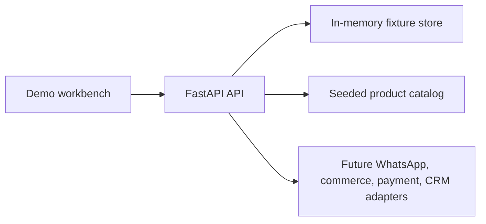

# WhatsApp Commerce and Support Agent

Fixture-first commerce and support workbench for controlled inbound WhatsApp conversations, product questions, checkout-link creation, outbound policy checks, delivery events, and human handoff.

## Project status

This repository is a deterministic demo. The current implementation does not claim live Meta/Twilio, Shopify/WooCommerce, Stripe, or HubSpot capability. Provider authentication, durable state, queues, retries, audit persistence, and production workspace authorization remain the next integration boundary.

## Architecture



## Included capabilities

- Normalized inbound identity and replay deduplication.
- Workspace-scoped conversation, order, and delivery fixture flows.
- Product facts, quantity confirmation, and distinct payment-link state.
- Approved-template validation and outbound policy rechecks.
- Idempotent outbound commands, failure classification, retry, and handoff.
- Responsive demo workbench with desktop/mobile Playwright coverage.

## Quick start

Prerequisites: Python 3.11+, [`uv`](https://docs.astral.sh/uv/), Node.js/npm for browser tests, and PowerShell.

```powershell
uv run --with-requirements requirements.txt python -m uvicorn apps.api.main:app --host 127.0.0.1 --port 8105
```

Or use the launcher:

```powershell
.\start-dev.ps1
```

Open `http://127.0.0.1:8105/demo`, load the inbound fixture, ask about the blue product, select quantity two, and create the test checkout link.

## Verification

```powershell
uv run --with-requirements requirements.txt pytest -q
npm --prefix e2e ci
npm --prefix e2e run test
```

The fixture clock, reset, readiness, policy, idempotency, delivery, handoff, and responsive browser paths are covered without paid provider credentials.

## Project structure

```text
apps/api/       FastAPI routes, policies, stores, and fixture workflows
apps/web/       Demo workbench
db/             Schema and seed migration artifacts
e2e/             Playwright configuration and browser tests
tests/           API, workflow, policy, reset, and analytics tests
```

## Showcase operations

```powershell
Invoke-RestMethod http://127.0.0.1:8105/health
Invoke-RestMethod http://127.0.0.1:8105/ready
Invoke-RestMethod -Method Post http://127.0.0.1:8105/demo/reset
```

Reset affects only the in-memory fixture. `/health` reports process liveness; `/ready` reports fixture readiness. Payment-link creation remains distinct from payment confirmation.

## Production boundary

Before live traffic, add authenticated workspace membership, signed inbound webhook verification, PostgreSQL persistence, durable queues and dead letters, provider delivery reconciliation, opt-out/consent controls, audit retention, backups, rate limits, observability, and recovery tests. The demo reset and caller-supplied workspace header are fixture-only boundaries.
